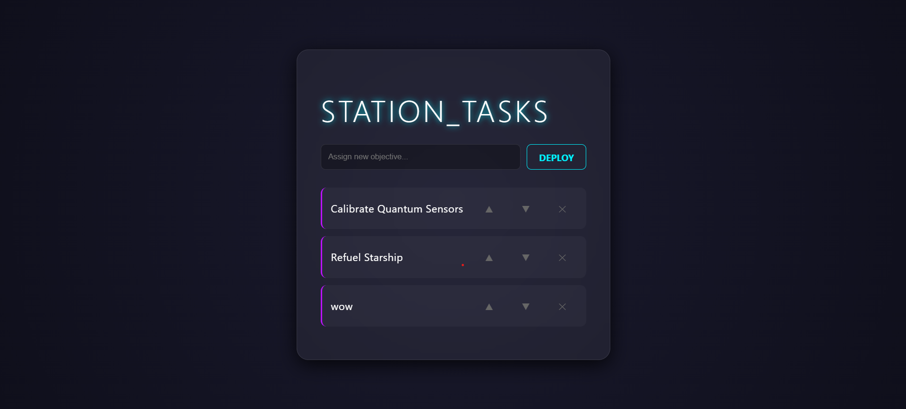

# 🌌 NEURAL-TASK-STATION

A high-performance, **Glassmorphism-inspired** To-Do application built with React. This interface utilizes backdrop filters and neon accents to provide a futuristic "command center" feel for daily task management.

## 🚀 Features

- **Glassmorphism UI:** Semi-transparent containers with high-end background blurs.
- **Dynamic Task Management:** Real-time adding, deleting, and re-ordering of objectives.
- **Responsive Control:** Optimized for both mouse and keyboard (`Enter` to deploy tasks).
- **State Immutability:** Uses modern React `useState` hooks with proper array spread patterns for clean state transitions.

---

## 🛠️ Tech Stack

- **Library:** React.js (Hooks-based)
- **Styling:** CSS3 (Custom Variables, Backdrop-filters, Flexbox)
- **Theme:** Cybernetic Dark Mode

---

## 📂 Project Structure

```text
src/
 ├── App.js            # Entry point & root container
 ├── ToDoList.jsx      # Core logic and UI components
 ├── App.css           # Futuristic styling & Neon themes
 └── index.js          # React DOM rendering
```

## ⚙️ Installation & Setup

To get your station online, follow these steps:

1.  Clone the repository

```bash
git clone [https://github.com/DulanDhanush/to-do-list-react-.git](https://github.com/DulanDhanush/to-do-list-react-.git)
```

2. Navigate to the directory

```bash
cd to-do-list-react-
```

3. Install dependencies

```bash
npm install
```

4. Launch the interface

```bash
npm start
```

## 🧪 Core Logic Preview

The application manages state using the useState hook, ensuring that the UI remains synced with the underlying data array.

```bash
// Example of the immutable swap logic used for re-ordering
const moveTask = (index, direction) => {
  const updatedTasks = [...tasks];
  const targetIndex = index + direction;
  [updatedTasks[index], updatedTasks[targetIndex]] = [updatedTasks[targetIndex], updatedTasks[index]];
  setTasks(updatedTasks);
};
```

## UI



## 🔮 Roadmap & Future Updates

- [ ] Neural Persistence: Integrate localStorage to save tasks across sessions.

- [ ] Motion Physics: Add Framer Motion for smooth sliding transitions.

- [ ] Priority Levels: Assign color-coded urgency to different tasks.

## Built with ⚡ by Dulan Dhanush
